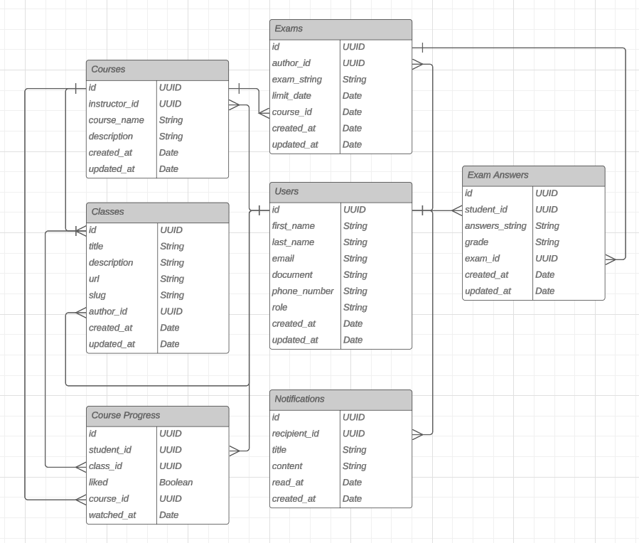

# Educational API

- The project consists on the api of a educational platform using nodejs and fastify.

## Technologies

- Nodejs
- Fastify
- Vitest
- Docker
- Redis

## ER DIAGRAM

## Fluxogram of the project

